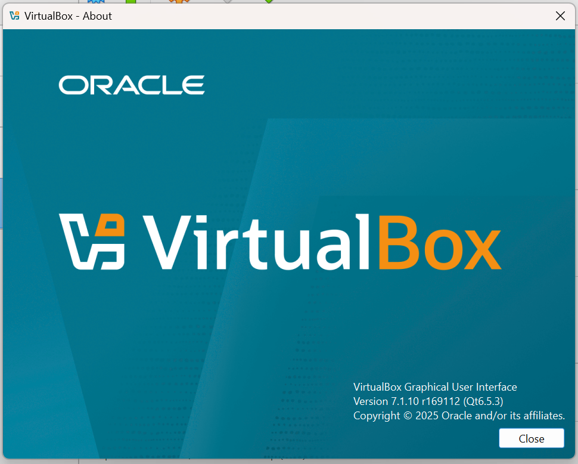

# Red Team Lab Setup – Step-by-Step Guide

This document covers the **full setup process** for creating an isolated red team penetration testing lab using **VirtualBox**, **Kali Linux** (attacker), **Metasploitable2** (Linux target), and **Windows 10** (Windows target).

## **Step 1 – Install VirtualBox**

- Download & install **VirtualBox** and the **Extension Pack** from [https://www.virtualbox.org](https://www.virtualbox.org).
- Launch VirtualBox to confirm installation.

## **Step 2 – Import Kali Linux VM**
- Download the **Kali Linux VirtualBox image** from [https://www.kali.org/get-kali/](https://www.kali.org/get-kali/).
- In VirtualBox: `File → Import Appliance → Select OVA file`.
- Click **Import** and wait for the process to complete.

## **Step 3 – First Boot of Kali**
- Start the Kali VM and log in:
	Username: kali
	Password: kali
- Confirm the desktop loads successfully.

## **Step 4 – Import Metasploitable2 VM**
- Download Metasploitable2 from [SourceForge](https://sourceforge.net/projects/metasploitable/).
- Create a new VirtualBox VM:
- **Type:** Linux
- **Version:** Ubuntu (32-bit)
- **RAM:** 1024 MB
- Use the `Metasploitable.vmdk` as the virtual hard disk.
- Finish creation.

## **Step 5 – Metasploitable Login Screen**
- Boot the Metasploitable VM.
- Default login:
	Username: msfadmin
	Password: msfadmin

## **Step 6 – Import or Prepare Windows 10 VM**
- Use an existing Windows 10 VM (or create from ISO).
- Allocate at least 4 GB RAM, 2 CPUs (you have 32 GB RAM available).

## **Step 7 – First Boot of Windows 10**
- Start the VM and ensure it boots successfully to the desktop.

## **Step 8 – Create Host-Only Network in VirtualBox**
- Go to: `File → Tools → Network Manager`.
- Under **Host-only Networks**, click **Create**.
- Set IPv4 to: `192.168.56.1/24`.
- Enable DHCP.

## **Step 9 – Assign Network Adapters**
- **Kali:** Adapter 1 → NAT, Adapter 2 → Host-Only  
- **Metasploitable2:** Adapter 1 → Host-Only  
- **Windows 10:** Adapter 1 → Host-Only
  
  

## **Step 10 – Verify Connectivity**
On Kali, open a terminal and ping both targets:
ping -c 4 192.168.56.107  # Metasploitable
ping -c 4 192.168.56.102  # Windows

## **Step 11 - Update kali packages**
* sudo apt update && sudo apt -y full-upgrade

## **Step 12 – Install Nmap**
* sudo apt install nmap -y

## **Step 13 – Quick Scan of Metasploitable**
* nmap -F 192.168.56.107

## **Step 14 – Full TCP Scan of Metasploitable**
* nmap -p- 192.168.56.107

## **Step 15 – Service & Version Detection**
* nmap -sV 192.168.56.107

## **Step 16 – OS Detection**
* nmap -O 192.168.56.107

## **Step 17 – Enable PowerShell Admin on Windows**
* Search for PowerShell, right-click, choose Run as Administrator.

## **Step 18 – Disable Windows Firewall (Temporarily)**
* Set-NetFirewallProfile -Profile Domain,Public,Private -Enabled False

## **Step 19 – Confirm Firewall Status**
* Get-NetFirewallProfile | Format-Table Name, Enabled

## **Step 20 – Full Nmap Scan of Windows**
* nmap -p- -sV -O 192.168.56.102

## **Step 21 – Re-enable Windows Firewall**
* Set-NetFirewallProfile -Profile Domain,Public,Private -Enabled True

## **Step 22 – Save Nmap Results**
**Save scan outputs in /scans:**
`nmap -p- -sV -O 192.168.56.107 -oN scans/metasploitable/full_scan.txt`
`nmap -p- -sV -O 192.168.56.102 -oN scans/windows/full_scan.txt`
